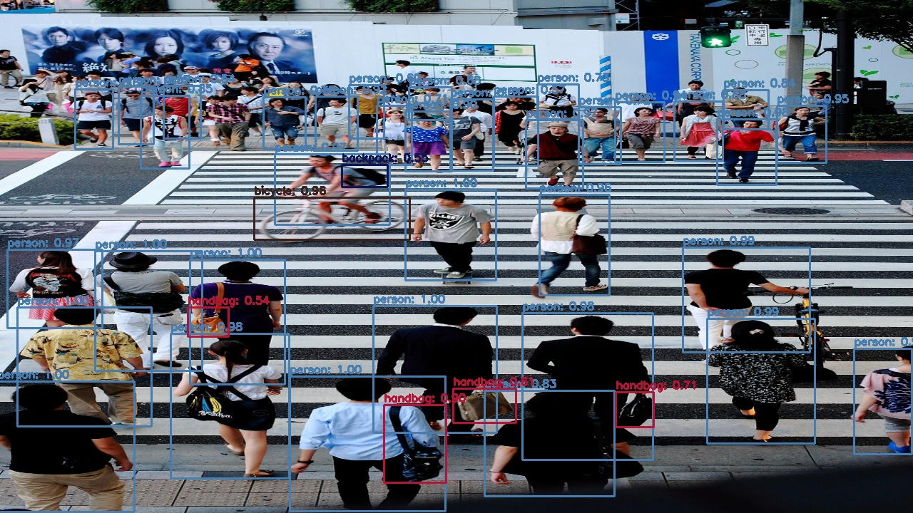

# 🎥 Detección de Objetos en Tiempo Real con YOLOv3 y OpenCV

[](https://www.python.org/)
[](https://opencv.org/)
[](https://numpy.org/)
[](https://pjreddie.com/darknet/yolo/)

Este proyecto es una implementación eficiente de visión artificial para la **detección, clasificación y etiquetado de objetos** en tiempo real. Utiliza el módulo **DNN de OpenCV** cargando el modelo pre-entrenado **YOLOv3** (entrenado con el dataset MS COCO, que reconoce hasta 80 categorías distintas). El sistema está diseñado para procesar tanto imágenes estáticas como secuencias de video.

---

## 🚀 Características Principales

*   **Procesamiento Dual:** Soporta imágenes fijas (como `img/shibuya.jpg`) y flujos de video (`img/shib.mp4`).
*   **Supresión de No Máximos (NMS):** Elimina cuadros delimitadores solapados redundantes para dejar solo la predicción más exacta por objeto.
*   **Colores Dinámicos:** Genera de forma pseudoaleatoria un color único para cada clase detectada, facilitando la visualización.
*   **Cálculo de Rendimiento (FPS):** Muestra los fotogramas por segundo procesados en tiempo real sobre el video de salida.
*   **Salida Automática:** Guarda los resultados en disco (`.jpg` para fotos y `.mp4` para videos).

---

## 📂 Estructura del Proyecto

```text
├── img/
│   ├── shibuya.jpg             # Imagen de entrada de prueba
│   └── shib.mp4                # Video de entrada de prueba
├── coco.names                  # Nombres de las 80 clases del dataset MS COCO
├── yolov3.cfg                  # Archivo de configuración de la arquitectura YOLOv3
├── Ex3_MaldonadoAcevedo.py     # Código fuente principal en Python
├── yolo_detection_result.jpg   # Resultado generado tras procesar la imagen
├── .gitignore                  # Configuración para ignorar archivos grandes (pesos y salidas)
└── README.md                   # Documentación oficial del proyecto
```

> [!NOTE]
> El archivo `yolov3.weights` (pesos del modelo) no se sube a GitHub debido a su peso (~248 MB), pero se puede descargar fácilmente (ver sección de instalación).

---

## 🛠️ Instalación y Requisitos

### 1. Clonar el repositorio
```bash
git clone https://github.com/tu-usuario/nombre-del-repositorio.git
cd nombre-del-repositorio
```

### 2. Instalar dependencias
Asegúrate de tener Python 3.7 o superior instalado. Instala las dependencias necesarias con:
```bash
pip install opencv-python numpy
```

### 3. Descargar los pesos de YOLOv3 (Requerido)
El archivo de pesos es indispensable para que el modelo funcione. Descárgalo directamente del sitio oficial de Darknet y guárdalo en la raíz del proyecto:

*   **Desde la terminal (Linux/macOS/Git Bash):**
    ```bash
    curl -o yolov3.weights https://pjreddie.com/media/files/yolov3.weights
    ```
*   **O descargándolo manualmente desde tu navegador:** [yolov3.weights (248 MB)](https://pjreddie.com/media/files/yolov3.weights)

---

## 💻 Modo de Uso

Puedes cambiar fácilmente entre el modo de detección en **video** o en **imagen** modificando las variables booleanas directamente en el archivo `Ex3_MaldonadoAcevedo.py` (líneas 28-30):

```python
# Cambiar a True para usar video, False para usar imagen
USE_VIDEO = True  # O False para procesar imagen
VIDEO_PATH = 'img/shib.mp4'
IMAGE_PATH = 'img/shibuya.jpg'
```

### Ejecutar el Script
Ejecuta el archivo desde tu terminal:
```bash
python Ex3_MaldonadoAcevedo.py
```

*   **En modo Imagen:** Se procesará la imagen, se mostrará en pantalla y se guardará como `yolo_detection_result.jpg`. Presiona cualquier tecla para cerrar la ventana.
*   **En modo Video:** Se procesará fotograma a fotograma, mostrando el procesamiento en tiempo real con sus respectivos FPS. Al finalizar (o al presionar la tecla `q`), el video se guardará como `yolo_detection_video.mp4`.

---

## 📊 Resultados

### 📸 Resultado en Imagen (`yolo_detection_result.jpg`)
A continuación se muestra un ejemplo de detección de múltiples objetos (personas, autos, autobuses, paraguas) en una calle concurrida:

<p align="center">
  
</p>

### 🎬 Resultado en Video (`yolo_detection_video.mp4`)
A continuación se muestra la demostración de detección en tiempo real procesando la secuencia de video en Shibuya:

<p align="center">
  <video src="https://github.com/user-attachments/assets/9e5f5701-7479-4d86-9a7e-3e581330f0e3" width="90%" controls>
    Tu navegador no soporta la reproducción de video.
  </video>
</p>

---

## 🧠 ¿Cómo funciona técnicamente?

1.  **Carga del Modelo:** Se lee la arquitectura de red (`yolov3.cfg`) y los pesos (`yolov3.weights`) mediante `cv2.dnn.readNet`.
2.  **Preparación de la Imagen (Blob):** Se convierte el frame en un *Blob de entrada* (`cv2.dnn.blobFromImage`) escalando sus píxeles (1/255) y redimensionándolo a `416x416` (resolución estándar de YOLOv3).
3.  **Feed-Forward:** El blob pasa a través de la red neuronal y se extraen las predicciones de las capas de salida no conectadas.
4.  **Filtrado por Confianza:** Se descartan aquellas detecciones cuyo puntaje de confianza sea menor al 50% (`confidence > 0.5`).
5.  **Supresión de No Máximos (NMS):** YOLO puede detectar varias cajas para un mismo objeto. `cv2.dnn.NMSBoxes` selecciona la caja más representativa basándose en su confianza e intersección sobre unión (IoU) con un umbral del 40% (`0.4`).
6.  **Visualización:** Se dibuja el rectángulo y el nombre de la clase correspondiente (obtenido de `coco.names`) junto al porcentaje de exactitud.
